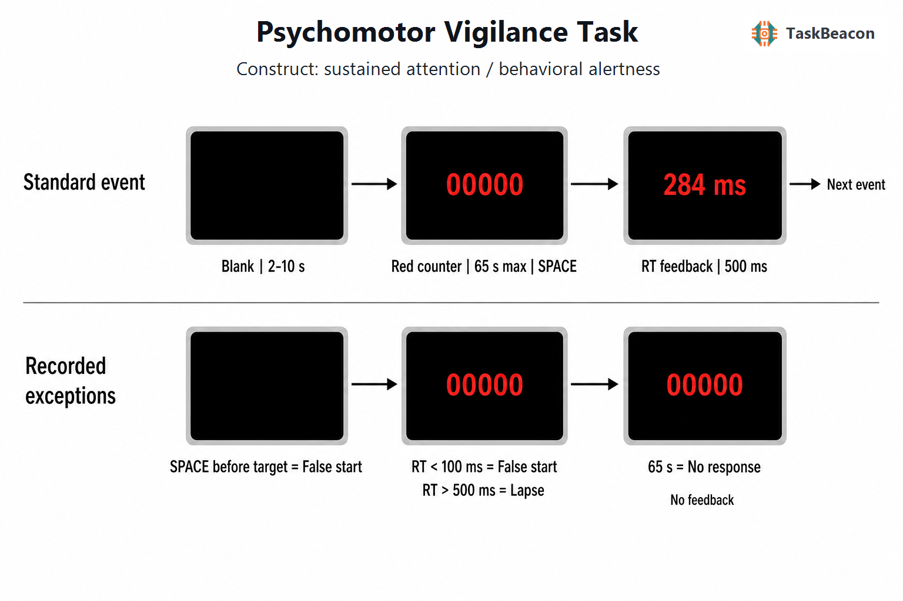

# 精神运动警觉任务：行为警觉性的实验逻辑、睡眠敏感性与测量边界

持续维持快速反应能力是睡眠—觉醒调节研究中的核心测量问题。主观困倦报告容易受到参照标准、动机和自我觉察差异影响，而复杂认知任务又会混入学习、策略与能力差异。精神运动警觉任务（Psychomotor Vigilance Task, PVT）以随机时刻出现的单一视觉目标和单键反应构成低选择负荷的连续测量，使反应速度分布、偶发迟缓和任务内衰退能够在同一记录中分离。该范式因此主要测量行为警觉性（behavioral alertness）或警觉性注意，而非一般智力或某一种孤立的感觉—运动速度。其突出价值在于对睡眠不足、昼夜节律错位及持续作业疲劳较敏感，同时练习效应相对有限（Basner et al., 2018; Lim & Dinges, 2008）。这种敏感性仍须结合任务时长、反应—刺激间隔、设备时延和所选指标解释。

## 1. 范式提出与理论背景

Dinges 与 Powell（1985）为持续作业情境开发了便携式简单视觉反应时任务。该设计保留了经典警觉研究对长时间注意维持的关注，却以约 10 分钟的密集重复采样取代持续数十分钟乃至数小时的低事件率检测。随后形成的标准 PVT 通常包含约 80–100 次目标事件；目标在 2–10 秒的随机反应—刺激间隔（response-stimulus interval, RSI）后出现，参与者只需尽快作出同一反应（Dinges & Powell, 1985; Honn & Van Dongen, 2023）。随机 RSI 限制了按固定节律预备反应的可能，使每次目标出现前都需要维持反应准备。

PVT 对睡眠损失的解释基础是“唤醒状态不稳定性”：睡眠压力增加后，较快反应与显著迟缓反应交替出现，反应时分布右偏并产生更多长尾事件。这种变化不能由均值减慢完整刻画，因而遗漏次数、反应速度和分布尾部指标成为范式的主要结果（Basner & Dinges, 2011; Lim & Dinges, 2008）。慢反应也不宜被视为瞬时“注意关闭”的直接观测；它同时包含感觉编码、决策积累、运动执行和短时补偿失败。PVT 操作简洁所减少的是选择与学习负荷，并未消除这些组成过程。

PVT 与连续操作测验的构念覆盖并不相同。连续操作测验通常要求区分目标与非目标，并以命中、漏报和虚报估计辨别能力或反应抑制；PVT 每次目标都要求同一反应，主要信息来自反应时连续分布及其随状态和作业时间的改变。PVT 中的“遗漏”是超过预设反应时阈值的迟缓反应，并非未识别目标的纯准确性错误。因此，PVT 结果可以支持行为警觉性下降的判断，却不能据此区分选择性注意、抑制控制或知觉辨别中的具体缺陷。若研究问题涉及这些过程，应增加具有非目标或反应选择条件的任务，而不宜给 PVT 指标附加超出操作定义的构念含义。

## 2. 任务逻辑、流程与核心参数

标准试次从空白等待阶段开始。目标出现前按键记为过早反应；目标通常为递增的毫秒计数器，按键后停止计时并呈现本次反应时反馈。若在规定窗口内未反应，则记录无反应。传统 10 分钟版本常采用 2–10 秒 RSI、约 80–100 个事件和约 1 秒反馈（Dinges & Powell, 1985; Honn & Van Dongen, 2023; Khitrov et al., 2014）。目标只有一种、反应也只有一种，因此不存在正确选项与干扰选项之间的辨别对比。

常用因变量对应不同的分布特征。平均或中位反应时描述整体速度，但容易受长尾影响；反应速度通常以反应时倒数表示，可降低正偏分布对参数统计的影响；反应时大于 500 ms 的事件通常定义为遗漏，小于 100 ms 或目标前反应定义为过早反应（Basner & Dinges, 2011）。遗漏数与最慢反应对睡眠损失敏感，最快反应则更多约束相对完整状态下的感觉—运动速度上限。沿事件序号或分钟计算的速度斜率反映任务时长效应，但同时受到睡眠压力、动机与局部策略调整影响。

RSI 不是中性的时间填充。标准 PVT 中较短 RSI 往往伴随更慢表现，睡眠剥夺可放大这一关系；任务进行时间增加也常导致速度下降和遗漏上升（Honn & Van Dongen, 2023）。不过，将 RSI 缩短至 2–5 秒并提高刺激密度，并未在固定 10 分钟时长下增强对全睡眠剥夺的敏感性，反而减弱了任务内衰退。这说明事件数量并非睡眠敏感性的充分解释，等待期中的持续准备和补偿努力可能参与形成效应（Honn & Van Dongen, 2023）。

## 3. 主要行为与神经科学发现

### 3.1 睡眠损失、昼夜调节与状态不稳定

PVT 最稳定的用途是量化睡眠—觉醒状态对行为警觉性的影响。连续多日限制睡眠可产生累积性 PVT 损害，而且主观困倦与客观表现的变化幅度并不总是同步（Van Dongen et al., 2003）。综合研究进一步表明，PVT 对全睡眠剥夺和慢性睡眠限制均有反应，但其效应量相对于多次睡眠潜伏期试验和清醒维持试验会随睡眠损失类型改变；PVT 不能被理解为所有困倦操作下恒定最敏感的工具（Chaisilprungraung et al., 2022）。

睡眠不足主要扩大反应时分布的右尾并增加表现波动，而非使所有反应等比例变慢（Lim & Dinges, 2008）。因此，单独报告平均反应时可能低估短暂迟缓；只报告遗漏数又会丢失阈值以下的连续变化。Basner 与 Dinges（2011）建议联合考虑反应速度、遗漏与过早反应，以覆盖整体减慢、注意不稳定和冲动反应。研究设计还应预先规定有效反应范围、阈值和汇总规则，因为跨版本阈值变化会改变效应量和被试排序。

### 3.2 fMRI、EEG 与血氧动力学证据

任务态功能磁共振成像（functional magnetic resonance imaging, fMRI）显示，充分休息时的较快反应伴随持续注意网络及皮层—皮层下运动系统更强的条件相关活动；较慢反应，尤其是全睡眠剥夺后的极慢反应，与额部及后部中线默认网络活动增强相关（Drummond et al., 2005）。该结果支持表现波动涉及任务相关网络参与下降与默认网络介入，但血氧水平依赖信号不能单独证明某一网络导致了反应迟缓。扫描体位、噪声和按键装置也限制其与桌面版绝对反应时的直接比较。

脑电图（electroencephalography, EEG）研究提供了状态变化的时间尺度证据。部分睡眠限制后，静息期中央偏右的 α 活动下降，个体 α、δ 功率变化与随后 PVT 表现及主观困倦变化相关；该研究的 EEG 记录位于任务前静息期，因而支持的是警觉状态指标与 PVT 表现的关联，而不是单试次事件相关因果过程（Shenfield et al., 2020）。功能性近红外光谱研究则发现快、慢 PVT 反应对应不同的额顶血氧动力学模式，为表现波动的网络解释提供了可移动测量证据；其空间覆盖和血流信号性质同样不允许将局部活动等同于特定心理过程（Nogueira et al., 2022）。现有多模态证据较一致地指向注意维持、默认网络抑制与运动准备的共同参与，对各组成过程的因果权重仍缺少直接操控。

## 4. 范式发展与主要应用

应用场景对测试时长的要求推动了 5 分钟、3 分钟和自适应版本。早期研究发现，少于 10 分钟的截短记录会损失标准版所包含的任务内衰退信息，且越短版本越需要独立效度依据（Loh et al., 2004）。在受控睡眠损失和酒精操作中，3 分钟便携版的反应速度与 10 分钟版高度相关，并能检出状态损害；它与部分航空作业任务的关联也支持适勤自测用途（Benderoth et al., 2021）。这些结果说明短版可用于特定状态筛查，不能证明其与标准版所有分布指标等价。

自适应时长 PVT-BA 根据每次反应更新高、中、低表现类别的后验优势，在训练和独立睡眠限制样本中与完整 3 分钟 PVT-B 达到较高分类一致性，平均用时约 1 分 43 秒（Basner, 2022）。该发展将测量目标从连续参数估计部分转向类别判定，适合高频现场监测，却不适合直接替代需要稳定估计任务内斜率或分布尾部的设计。桌面平台、手持设备和浏览器实现拓展了现场研究；跨平台输入延迟与显示刷新差异仍需校准，因为数十毫秒的系统偏差可能改变反应速度，并使接近 500 ms 阈值的事件跨越分类边界（Khitrov et al., 2014）。

## 5. 测量效度与解释边界

PVT 对睡眠限制、全睡眠剥夺及酒精操作的已知组效应构成较强的状态敏感性证据（Benderoth et al., 2021; Van Dongen et al., 2003）。重复施测研究表明，常用的平均/中位反应时、反应速度和遗漏未呈系统性练习变化；最快与最慢尾部及过早反应仍有幅度较小的重复施测效应（Basner et al., 2018）。由此不能把“练习效应较小”写成所有指标完全无练习效应。

个体差异研究需要更严格地区分可靠性与组水平敏感性。5 分钟版中平均反应时和最快 10% 反应相对可靠，而遗漏、预期反应、反应时标准差及任务内变化等指标的重测信度较差（Thompson et al., 2022）。开源 PEBL 测试的评估也显示，速度指标的信度总体优于准确性、速度变异和随时间衰退指标；样本量较小和跨站点条件差异限制了概化（Langner et al., 2023）。稳定的睡眠损失组效应不保证一次测量能够可靠地排列个体。

PVT 结果还受年龄、运动能力、视觉条件、药物、咖啡因、动机、测试时刻和设备时延影响。遗漏阈值是操作定义，不是临床诊断界值；较多遗漏不能单独确定睡眠障碍、神经系统疾病或不适任。PVT 与主观困倦测量关注的对象也不相同，两者不一致不必然表示任一测量无效。用于纵向或干预研究时，宜固定设备、时刻、任务版本和反馈规则，报告完整反应分布，并将主要指标和剔除规则预先注册。

分析层面还需避免由阈值和数据稀疏造成的伪差异。充分休息者在短版中可能仅出现零至数次遗漏，计数指标会出现地板效应，单个临界反应即可显著改变比例；最慢 10% 反应在事件数较少时同样由极少观测决定。反应速度平均值可提高分布稳定性，但它回答的是整体速度变化，不能替代对偶发长时迟缓的检验。对重复测量数据，混合效应模型可在试次层面纳入 RSI、事件顺序和测量时刻，减少先汇总再比较造成的信息损失。该策略仍依赖事先确定的数据清理规则，不能补偿平台时延未知或任务版本不一致。

## 6. TaskBeacon 中的任务实现

### 6.1 任务资源与访问入口

| 资源 | ID | 用途 | 地址 |
|---|---|---|---|
| 完整行为实验源码 | T000056 | PsychoPy/PsyFlow 研究实现，90 个连续事件 | [GitHub](https://github.com/TaskBeacon/T000056-psychomotor-vigilance-task) |
| 浏览器预览源码 | H000056 | 12 事件的行为型网页预览 | [GitHub](https://github.com/TaskBeacon/H000056-psychomotor-vigilance-task) |
| 在线运行入口 | H000056 | 通过共享 runner 体验浏览器预览 | [运行任务](https://taskbeacon.github.io/psyflow-web/?task=H000056-psychomotor-vigilance-task) |

H000056 保留完整实现的等待范围、目标、反应键、分类阈值、超时和反馈语义，但将 90 个事件缩短为 12 个。它适合熟悉流程，不等同于完整 10 分钟测量，也不应据此估计标准版的任务内衰退。

### 6.2 实现流程与关键参数

TaskBeacon 当前版本采用中文指导语、黑色全屏背景和单个 `standard` 条件。一个不间断区块包含 90 个事件；每次事件先呈现 2–10 秒均匀抽样的空白 RSI，再出现红色五位动态毫秒计数器。参与者按空格键反应，目标前按键或目标出现后小于 100 ms 的反应记为过早反应，大于 500 ms 记为遗漏，65 秒内无反应记为无反应；非过早反应后呈现 500 ms 的整数毫秒反馈。该实现不使用自适应控制器。主要记录包括反应时、有效反应、遗漏、过早反应、无反应及事件顺序，可据此计算平均/中位反应时、反应速度和任务内变化。

**图 1. TaskBeacon PVT 的事件流程与判定规则。** 实验依次包括中文指导、单个连续区块和完成汇总。每个 `standard` 事件从黑色空白 RSI 开始，持续时间在 2–10 秒内均匀抽样；此阶段按空格键立即终止事件并记为过早反应。未提前反应时，中央红色五位毫秒计数器出现并持续至按键或 65 秒超时。目标后反应时小于 100 ms 仍归为过早反应，不呈现反馈；100–500 ms 归为有效非遗漏反应，大于 500 ms 归为遗漏，两者均显示 500 ms 的 RT 反馈；超时记为无反应且直接进入下一事件。全程共 90 个事件，不进行难度或时限自适应。

## 参考文献

Basner, M. (2022). Ultra-short objective alertness assessment: An adaptive duration version of the 3 minute PVT (PVT-BA) accurately tracks changes in psychomotor vigilance induced by sleep restriction. *SLEEP Advances, 3*(1), zpac038. https://doi.org/10.1093/sleepadvances/zpac038

Basner, M., & Dinges, D. F. (2011). Maximizing sensitivity of the Psychomotor Vigilance Test (PVT) to sleep loss. *Sleep, 34*(5), 581–591. https://doi.org/10.1093/sleep/34.5.581

Basner, M., Hermosillo, E., Nasrini, J., McGuire, S., Saxena, S., Moore, T. M., Gur, R. C., & Dinges, D. F. (2018). Repeated administration effects on Psychomotor Vigilance Test performance. *Sleep, 41*(1), zsx187. https://doi.org/10.1093/sleep/zsx187

Benderoth, S., Hörmann, H.-J., Schießl, C., & Elmenhorst, E.-M. (2021). Reliability and validity of a 3-min psychomotor vigilance task in assessing sensitivity to sleep loss and alcohol: Fitness for duty in aviation and transportation. *Sleep, 44*(11), zsab151. https://doi.org/10.1093/sleep/zsab151

Chaisilprungraung, T., Stekl, E. K., Thomas, C. L., Blanchard, M. E., Hughes, J. D., Balkin, T. J., & Doty, T. J. (2022). Quantifying the effects of sleep loss: Relative effect sizes of the psychomotor vigilance test, multiple sleep latency test, and maintenance of wakefulness test. *SLEEP Advances, 3*(1), zpac034. https://doi.org/10.1093/sleepadvances/zpac034

Dinges, D. F., & Powell, J. W. (1985). Microcomputer analyses of performance on a portable, simple visual RT task during sustained operations. *Behavior Research Methods, Instruments, & Computers, 17*(6), 652–655. https://doi.org/10.3758/BF03200977

Drummond, S. P. A., Bischoff-Grethe, A., Dinges, D. F., Ayalon, L., Mednick, S. C., & Meloy, M. J. (2005). The neural basis of the psychomotor vigilance task. *Sleep, 28*(9), 1059–1068. https://pubmed.ncbi.nlm.nih.gov/16268374/

Honn, K. A., & Van Dongen, H. P. A. (2023). Paradoxical effects from stimulus density manipulation provide new insight into the impact of sleep deprivation on PVT performance. *SLEEP Advances, 4*(1), zpac045. https://doi.org/10.1093/sleepadvances/zpac045

Khitrov, M. Y., Laxminarayan, S., Thorsley, D., Ramakrishnan, S., Rajaraman, S., Wesensten, N. J., & Reifman, J. (2014). PC-PVT: A platform for psychomotor vigilance task testing, analysis, and prediction. *Behavior Research Methods, 46*(1), 140–147. https://doi.org/10.3758/s13428-013-0339-9

Langner, R., Scharnowski, F., Ionta, S., Salmon, C. E. G., Piper, B. J., & Pamplona, G. S. P. (2023). Evaluation of the reliability and validity of computerized tests of attention. *PLOS ONE, 18*(1), e0281196. https://doi.org/10.1371/journal.pone.0281196

Lim, J., & Dinges, D. F. (2008). Sleep deprivation and vigilant attention. *Annals of the New York Academy of Sciences, 1129*(1), 305–322. https://doi.org/10.1196/annals.1417.002

Loh, S., Lamond, N., Dorrian, J., Roach, G., & Dawson, D. (2004). The validity of psychomotor vigilance tasks of less than 10-minute duration. *Behavior Research Methods, Instruments, & Computers, 36*(2), 339–346. https://doi.org/10.3758/BF03195580

Nogueira, M. G., Silvestrin, M., Barreto, C. S. F., Sato, J. R., Mesquita, R. C., Biazoli, C., & Baptista, A. F. (2022). Differences in brain activity between fast and slow responses on psychomotor vigilance task: An fNIRS study. *Brain Imaging and Behavior, 16*(4), 1563–1574. https://doi.org/10.1007/s11682-021-00611-8

Shenfield, L., Beanland, V., Filtness, A., & Apthorp, D. (2020). The impact of sleep loss on sustained and transient attention: An EEG study. *PeerJ, 8*, e8960. https://doi.org/10.7717/peerj.8960

Thompson, B. J., Shugart, C., Dennison, K., & Louder, T. J. (2022). Test-retest reliability of the 5-minute psychomotor vigilance task in working-aged females. *Journal of Neuroscience Methods, 365*, 109379. https://doi.org/10.1016/j.jneumeth.2021.109379

Van Dongen, H. P. A., Maislin, G., Mullington, J. M., & Dinges, D. F. (2003). The cumulative cost of additional wakefulness: Dose-response effects on neurobehavioral functions and sleep physiology from chronic sleep restriction and total sleep deprivation. *Sleep, 26*(2), 117–126. https://doi.org/10.1093/sleep/26.2.117
